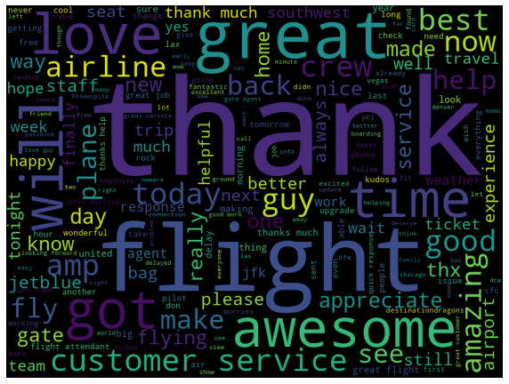
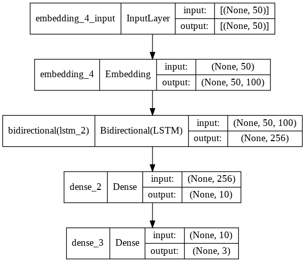
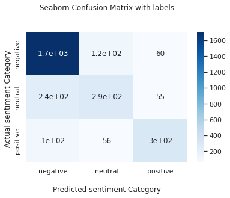

# Airline_sentiment_analysis
Implementing sentiment analysis using different models from A to Z Using NLP techniques

## Implemntation steps:

1. Get dataset from [Kaggle](https://www.kaggle.com/crowdflower/twitter-airline-sentiment)
2. Import required libraries
3. Analize the data
4. Make required data preprocessing
5. Make some plots
6. Split the data into train, validaton and test set
7. Creating 3 models [Logistic regression, Naive bayes and LSTM neural network]
8. Doing validation techniques
9. find the best model for this data
10. Use the best model to test the data

## **Created by: Mohamed Fadl**
